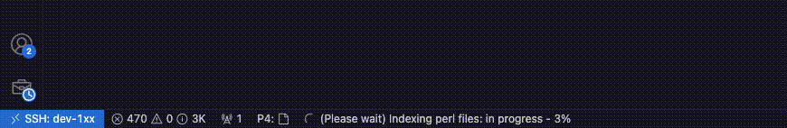

# 🐪 Perl IDE

A simple perl language server written in typescript, with a client that's also written in typescript. Intended to be used with vs code, but could be extended.

## 💡 Language Features

- 🔍 Syntax Checking
- 🔗 Go to Definition
- ✏️ Rename Symbol
- 📚 Autocomplete (without package import)
- 🧭 Find References
- 🖱️ Hover Info
- ✨ Semantic Highlighting
- 📘 Symbol Highlighting
- 🐞 Debugger

## ▶️ Perl Debugger

A modern Debugger Extension for Perl integrated with the Perl Language Server (PLS). This extension enables you to debug Perl scripts directly within VS Code using the built-in `perl -d` debugger interface.

> ⚠️ Windows support is not guaranteed. Tested on **Linux** and **macOS**.


### ✨ Features

- ✅ Set **breakpoints** in your Perl scripts
- ✅ **Step Over**, **Step In**, **Step Out**
- ✅ **Continue** execution
- ✅ View **local variables**
- ✅ Inspect **package/global variables**
- ✅ Evaluate **watch expressions**
- ✅ **Stack trace** visualization
- ✅ Integrated with the **Perl Language Server**

---

## 🚀 Getting Started

### 📦 Installation

1. **Install the Extension** from the VS Code Marketplace (or sideload your `.vsix`)
2. The first time when perl files are loaded, it might say "(Please wait) Indexing perl files", depending on the size of your project. This is a one time, the extension should create a `function_map.json` file under .vscode folder and use it as a cache next time it launches.


### Feature: 🐞 Using the debugger, launching perl script

1. (Only for using debugger) Ensure you have Perl installed and accessible in your PATH:
   ```bash
   perl -v
   ```
2. Create or open a `.pl` file and goto next step or, additionally, configure your `launch.json`:
    ```json
    {
        "type": "perl",
        "request": "launch",
        "name": "Launch current file",
        "program": "${file}",
        "stopOnEntry": false,
        "args": "",
        "env": {
            "LOL": 1
        }
    }
    ```
3. Hit `F5` to start debugging,

## ⚙️ Extension Settings

This extension contributes the following settings:

* `perl.maxNumberOfProblems`: Controls the maximum number of problems produced by the server.

## 🧪 Known Limitations

- ⚠️ `Webassembly.Memory(): could not allocate memory`
  - Its a problem with your node runtime, either upgrade your nodejs
  - Or, check out your `ulimit`. Further reading - https://stackoverflow.com/questions/52406217/why-cant-i-construct-webassembly-memory-in-browsers

- ❌ Windows compatibility is experimental
- ⚠️ Advanced data structure rendering (e.g. y @vars) is string-parsed, may have edge cases

## 📦 Release Notes
### 🟢 3.0.0
- Feature release, with a working debugger.
- check changelog for more details.

### 🟢 2.0.0 — Alpha Release
- alpha release, with usable features.

### 🟡 0.0.1

- Very beta, testing out the integration

### 🔘 0.1.0

- Somewhat beta, will work my way up to release further stable releases

-----------------------------------------------------------------------------------------------------------
